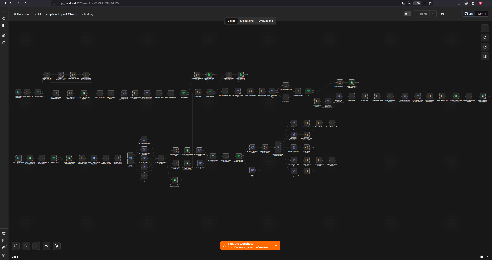
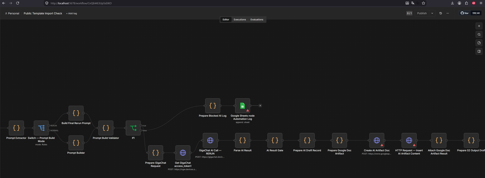
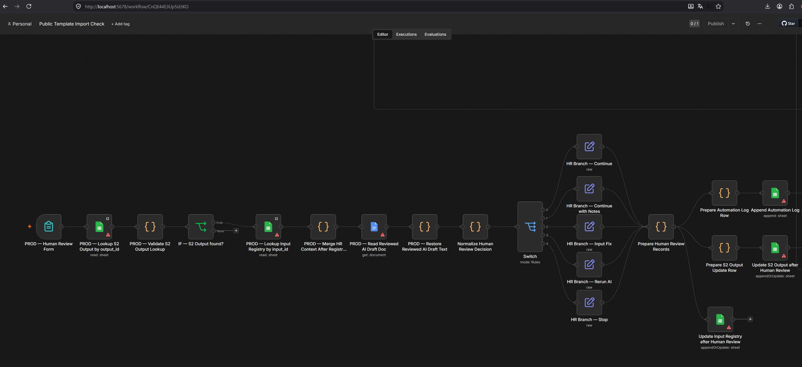
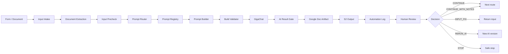

# AI Requirements Workflow for n8n

[](https://github.com/Mikhail-Shishenkov/n8n-ai-requirements-workflow/actions/workflows/audit.yml)

## О проекте

Это портфолио-проект по системному анализу и автоматизации обработки требований.

Workflow принимает текст требования или ссылку на Google Doc. Затем система проверяет входные данные, выбирает подходящий сценарий обработки, формирует запрос к GigaChat и проверяет полученный AI Draft.

Результат не передаётся дальше автоматически. Перед следующим шагом требуется ревью пользователя (Human Review). Пользователь может продолжить процесс, вернуть входные данные на исправление, запустить повторную обработку или остановить сценарий.

Проект показывает, как можно встроить LLM в управляемый процесс, где решения системы проверяются, журналируются и остаются под контролем человека.

## Общий вид workflow



## Проверка результата AI

AI Draft проходит отдельную проверку перед сохранением и передачей на Human Review.



## Решение пользователя

Результат не продолжает маршрут автоматически. Пользователь выбирает дальнейшее действие: продолжить процесс, вернуть вход на исправление, повторить обработку или остановить сценарий.



## Схема процесса



## Что умеет система

- Принимать требования в виде текста или ссылки на Google Doc.
- Проверять входные данные через Input Precheck.
- Формировать `safe_routes` и `blocked_routes`.
- Выбирать сценарий через Prompt Router и Prompt Registry для P001–P011.
- Формировать и проверять prompt перед вызовом GigaChat.
- Сохранять AI Draft, краткий результат и технический журнал.
- Поддерживать Human Review, повторный запуск и связь между версиями результата.

## Human Review

После обработки пользователь выбирает дальнейшее действие.

| Решение | Что происходит |
|---|---|
| `CONTINUE` | Процесс продолжается |
| `CONTINUE_WITH_NOTES` | Процесс продолжается с комментарием пользователя |
| `INPUT_FIX` | Входные данные возвращаются на исправление |
| `RERUN_AI` | Создаётся новая версия результата |
| `STOP` | Процесс останавливается |

AI Draft не считается финальным результатом без решения пользователя.

## Масштаб

- 93 узла;
- 101 связь;
- 5 вариантов Human Review.

## Проверки и безопасность

В репозитории опубликован очищенный шаблон:

`workflows/ai-requirements-workflow.template.json`

Публичная версия:

- выключена;
- не содержит pinned data;
- не содержит credentials и access tokens;

Шаблон проверяется локальным скриптом:

```bash
python scripts/audit_workflow.py workflows/ai-requirements-workflow.template.json
```


## Моя роль

В рамках проекта я:

- спроектировал последовательность обработки требования;
- определил входные данные, AI Draft и решения Human Review;
- настроил маршрутизацию и проверки между этапами;
- разделил полный результат, краткую карточку и технический журнал;
- спроектировал связь между исходной и повторными версиями результата;
- проверил основной, негативные и граничные сценарии;
- подготовил публичный шаблон без credentials и внутренних идентификаторов.

## Запуск

Для работы необходимо импортировать JSON в n8n, назначить собственные Google OAuth credentials, создать таблицы из шаблонов в `templates/google-sheets/` и настроить переменные окружения для GigaChat.

Подробная инструкция: [docs/SETUP.md](docs/SETUP.md).

## Технологии

n8n · GigaChat API · Google Drive · Google Docs · Google Sheets · JavaScript · HTTP Request · Human-in-the-loop · Quality Gates · Audit Logging

## Документация

- [Архитектура](docs/ARCHITECTURE.md)
- [Настройка](docs/SETUP.md)
- [Безопасность](docs/SECURITY.md)
