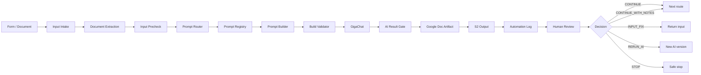

# AI Requirements Workflow for n8n

[](https://github.com/Mikhail-Shishenkov/n8n-ai-requirements-workflow/actions/workflows/audit.yml)


**Human-in-the-loop automation for safe AI-assisted requirements processing,
validation, audit logging and version lineage.**

Workflow принимает текст или Google Doc, оценивает качество входа, выбирает
безопасный prompt route, вызывает GigaChat, валидирует AI Draft, сохраняет
полный артефакт и требует Human Review перед дальнейшим движением.

## Архитектура



## Возможности

- text и Google Doc intake;
- Input Precheck с `safe_routes` и `blocked_routes`;
- LLM Prompt Router и отдельный Output Validator;
- Prompt Registry для P001–P011;
- Prompt Extractor, Builder и Build Validator;
- GigaChat router и work calls;
- AI Result Gate;
- Google Doc для полного AI Draft;
- S2 Output, Automation Log и Input Registry;
- пять Human Review решений;
- parent-child version lineage;
- отдельный rerun flow;
- fail-closed остановки.

## Масштаб

- 93 nodes;
- 101 connections;
- 47 Code nodes;
- 11 Google Sheets nodes;
- 8 HTTP Request nodes;
- 5 Human Review outcomes.

## Public template security

Публичный JSON:

- выключен;
- не содержит pinned data;
- не содержит credentials и access tokens;
- не содержит реальных Google IDs;
- не содержит webhook IDs и instance metadata;
- не отключает TLS certificate verification.

Проверка:

```bash
python scripts/audit_workflow.py workflows/ai-requirements-workflow.template.json
```

## Быстрый старт

1. Импортировать JSON в n8n.
2. Создать Google OAuth credentials.
3. Создать вкладки из `templates/google-sheets/`.
4. Заменить все `YOUR_*` placeholders.
5. Настроить GigaChat через переменные окружения.
6. Выполнить smoke test при выключенном workflow.
7. После проверки включить triggers.

Подробности: [docs/SETUP.md](docs/SETUP.md).

## Human Review

| Решение | Поведение |
|---|---|
| `CONTINUE` | Продолжить маршрут |
| `CONTINUE_WITH_NOTES` | Продолжить с ограничениями |
| `INPUT_FIX` | Вернуть вход на исправление |
| `RERUN_AI` | Создать новую AI-версию |
| `STOP` | Безопасно остановить процесс |

## Мой вклад

- спроектировал end-to-end AI workflow;
- определил контракты входа, AI Draft и Human Review;
- реализовал safe routing и quality gates;
- разделил полный артефакт, бизнес-карточку и технический лог;
- спроектировал version lineage и rerun flow;
- проверил happy path, negative и edge-case сценарии;
- подготовил безопасный публичный template.

## Технологии

n8n · GigaChat API · Google Drive · Google Docs · Google Sheets · JavaScript ·
HTTP Request · Human-in-the-loop · Quality Gates · Audit Logging

## Документация

- [Архитектура](docs/ARCHITECTURE.md)
- [Настройка](docs/SETUP.md)
- [Безопасность](docs/SECURITY.md)
